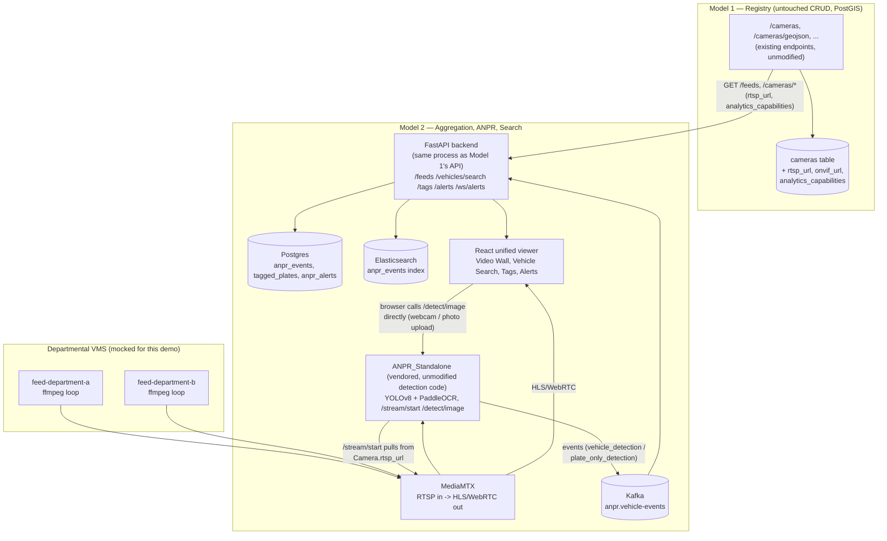

# Model 2 — Unified CCTV Viewing Platform: Architecture

Model 2 is built **on top of** Model 1 (the Gujarat CCTV GIS Registry), not beside it. Model 1's
`cameras` table stays the single source of truth for every camera; Model 2 adds a live-viewing,
ANPR, and search layer on top, and reads camera data through Model 1's *existing* API/DB — it never
maintains its own copy of "what cameras exist."

## Read-only, one direction

Model 2 only ever **pulls** from camera sources — via the RTSP URL stored on each `Camera` row —
and never writes back to departmental storage. MediaMTX relays that pulled RTSP as HLS/WebRTC;
ANPR_Standalone reads frames from the same pulled stream; nothing in this pipeline touches the
originating VMS. The "departmental VMS" boxes in the diagram are mocked (two looping video files)
because this demo has no real second VMS to connect to — everything downstream of them (MediaMTX
config, `Camera.rtsp_url`, ANPR's `/stream/start`) is exactly what would be pointed at a real
department's RTSP/ONVIF endpoint in production.

## What's additive to Model 1 vs. new in Model 2

| Layer | Change |
|---|---|
| `Camera` model | +3 nullable columns (`rtsp_url`, `onvif_url`, `analytics_capabilities`) — existing rows, existing endpoints, existing RBAC untouched |
| Camera CRUD, GIS map, coverage, audit logs, bulk upload | **Zero changes** to behavior |
| ANPR detection/tracking (`anpr_standalone/anpr/*.py`) | **Zero changes** — vendored as-is |
| ANPR wiring (`anpr_standalone/service/{api,sinks}.py`) | Small, README-documented edit: env-driven Kafka sink |
| New Postgres tables | `anpr_events`, `tagged_plates`, `anpr_alerts` — reference `cameras.camera_id`, never duplicate camera metadata |
| New routers | `/feeds`, `/vehicles/search`, `/vehicles/{plate}/history`, `/anpr-events`, `/tags`, `/alerts`, `/ws/alerts` — all department-scoped the same way Model 1's routers already are |

## Documented simplifications (for this demo)

1. **One MediaMTX instance plays both roles** — the mock "departmental VMS" publish target *and*
   Model 2's aggregation/relay. A real deployment would run a pull-relay per department pointed at
   that department's actual VMS RTSP/ONVIF endpoint; the stored `rtsp_url` and everything that reads
   it (ANPR's `/stream/start`, the browser's HLS player) would be unchanged.
2. **Two mock feeds** (`feed-department-a`/`b`, looping supplied video files) stand in for real
   department cameras — same convention as Model 1's own CSV-seeded registry being flagged
   `is_synthetic=True`.
3. **The Live Demo Panel (webcam / photo upload)** talks to ANPR_Standalone directly from the
   browser on its own exposed port — it is not tied to any registry camera, by design (it's the
   "bring your own footage" demo path, separate from the real RTSP camera tiles it sits alongside
   in the same Video Wall grid).

## Event flow (per ANPR_Standalone's own schema, unchanged)

1. `ANPRPipeline.process_frame()` (vendored, untouched) emits `vehicle_detection` /
   `plate_only_detection` events.
2. `service/sinks.py`'s `KafkaSink` (enabled via `KAFKA_BOOTSTRAP_SERVERS`) publishes to
   `anpr.vehicle-events`, keyed by `camera_id`.
3. **Consumer A** (in-process in the FastAPI backend, so it can push to live WebSocket clients):
   writes `AnprEvent`, checks the plate against active `TaggedPlate`s, on a match writes
   `AnprAlert` + an audit-log entry (via Model 1's existing `write_audit_log`) + broadcasts over
   `/ws/alerts`, scoped to the matching camera's department.
4. **Consumer B** (`consumer_es`, standalone container): indexes the same event into Elasticsearch
   for `/vehicles/search`.
5. `/vehicles/{plate}/history` reads Postgres directly (the durable store) for the movement-history
   map view, joining each event's `camera_id` back to `Camera` for coordinates/district/department.
